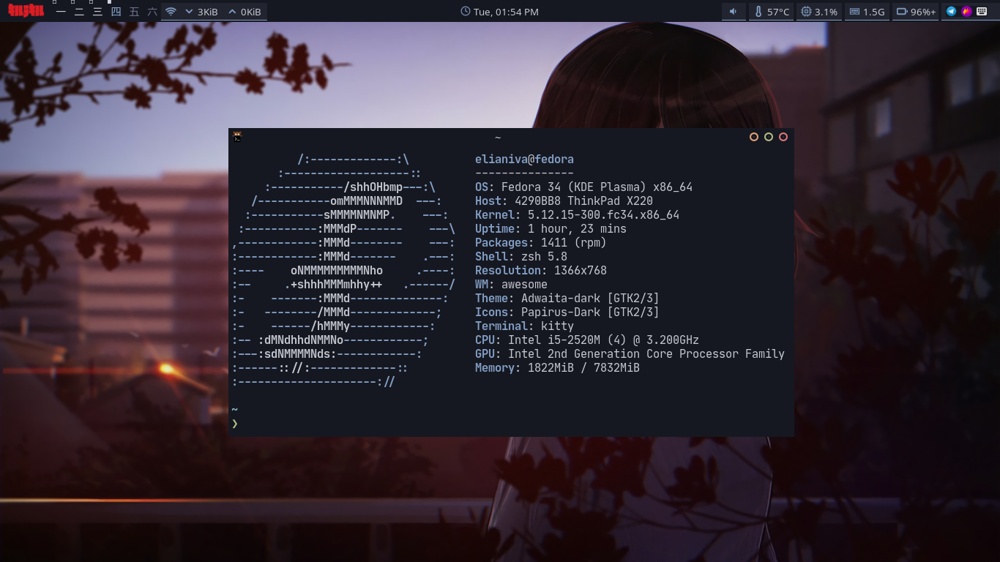

## dot dot dot

> Please do not blindly copy this thing. I use this place as a backup :)
>
> Feel free to take whatever you want, though.

  <kbd></kbd>
  <kbd></kbd>

[arch-link]: https://archlinux.org/
[fedora-link]: https://getfedora.org/
[awesome-link]: https://github.com/awesomewm/awesome
[i3-link]: https://github.com/i3/i3
[bspwm-link]: https://github.com/baskerville/bspwm
[openbox-link]: https://github.com/danakj/openbox
[neovim-link]: https://github.com/neovim/neovim
[alacritty-link]: https://github.com/alacritty/alacritty
[zsh-link]: http://www.zsh.org/
[zinit-link]: https://github.com/zdharma/zinit
[starship-link]: https://starship.rs/
[dunst-link]: https://github.com/dunst-project/dunst
[mako-link]: https://github.com/emersion/mako
[pcmanfm-link]: https://github.com/lxde/pcmanfm
[lf-link]: https://github.com/gokcehan/lf
[picom-link]: https://github.com/yshui/picom
[polybar-link]: https://github.com/polybar/polybar
[rofi-link]: https://github.com/davatorium/rofi
[pacman-link]: https://wiki.archlinux.org/index.php/pacman
[paru-link]: https://github.com/Morganamilo/paru
[zinit-link]: https://github.com/zdharma/zinit
[sxhkd-link]: https://github.com/baskerville/sxhkd
[tmux-link]: https://github.com/tmux/tmux
[sway-link]: https://github.com/swaywm/sway
[swaybar-link]: https://github.com/Alexays/Waybar
[kitty-link]: https://github.com/kovidgoyal/kitty
[wofi-link]: https://github.com/mikn/wofi
[mpv-link]: https://mpv.io/
[flameshot-link]: https://github.com/flameshot-org/flameshot
[spectacle-link]: https://apps.kde.org/spectacle/

---

### Some Details
- **Operating System:**
  - [Archlinux][arch-link]
  - [Fedora][fedora-link]
- **Window Manager:**
  - [AwesomeWM][awesome-link]
  - [Sway][sway-link]
  - [BSPWM][bspwm-link] (no longer using)
  - [i3][i3-link] (no longer using)
  - [Openbox][openbox-link] (no longer using)
- **Bar:**
  - [Polybar][polybar-link] (no longer using)
  - [Swaybar][swaybar-link]
- **Text Editor:**
  - [Neovim][neovim-link]
- **Terminal:**
  - [Kitty][kitty-link]
  - [Alacritty][alacritty-link] (no longer using)
- **Shell:**
  - [ZSH][zsh-link]
- **Screenshot Tool:**
  - [Flameshot][flameshot-link]
  - [Spectacle][spectacle-link]
- **Shell Prompt:**
  - [Starship][starship-link]
- **Package/Plugin Manager:**
  - [Pacman][pacman-link] (main package manager)
  - [Paru][paru-link] (AUR helper)
  - [Zinit][zinit-link] (ZSH plugin manager)
- **Launcher:**
  - [Rofi][rofi-link]
  - [Wofi][wofi-link] (no longer using)
- **Notification Daemon:**
  - [Mako][mako-link]
  - [Dunst][dunst-link] (no longer using)
- **File Manager:**
  - [Pcmanfm][pcmanfm-link] (GUI)
  - [lf][lf-link] (TUI)
- **Compositor:**
  - [picom][picom-link]
- **Video Player:**
  - [MPV][mpv-link]
- **Hotkey Daemon:**
  - [sxhkd][sxhkd-link] (no longer using)
- **Terminal Multiplexer:**
  - [tmux][tmux-link] (no longer using)
