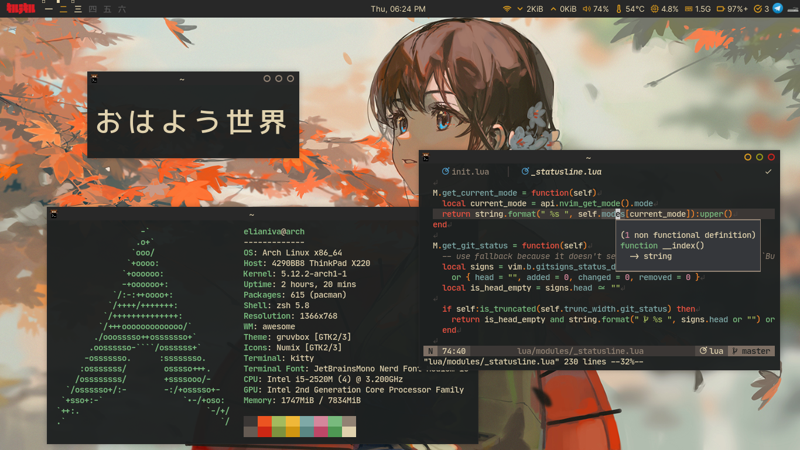
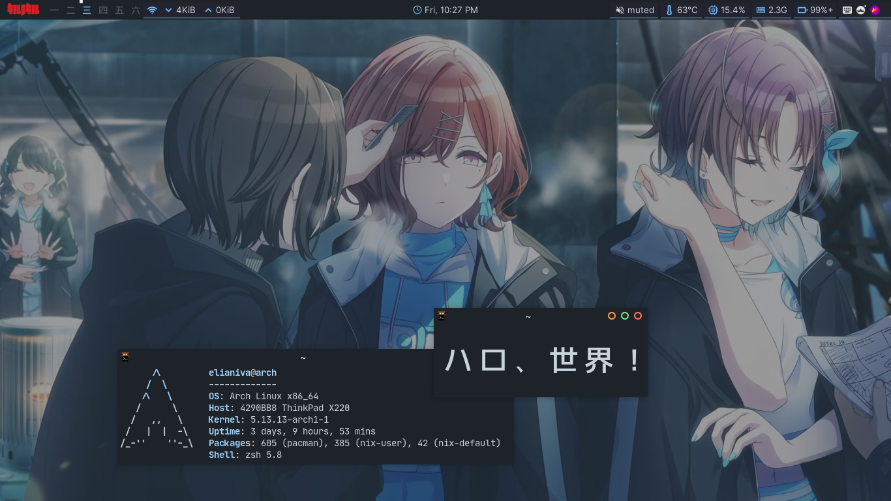
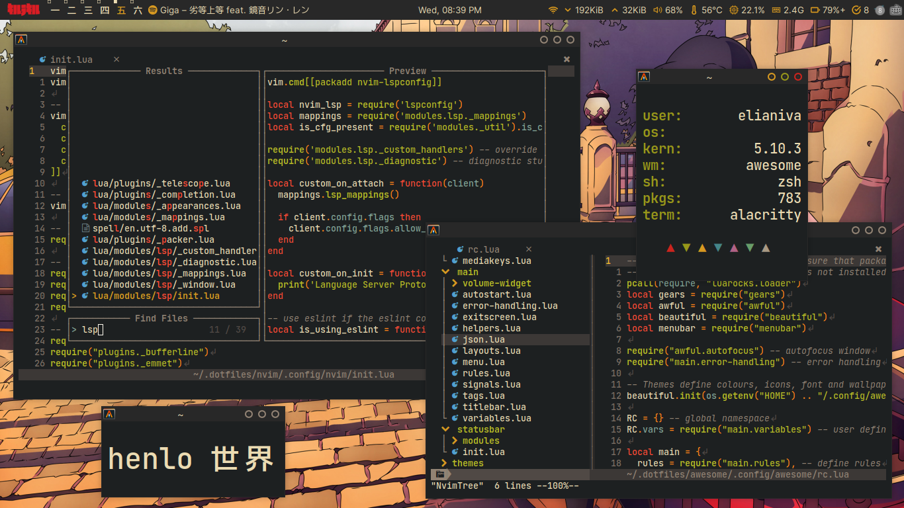
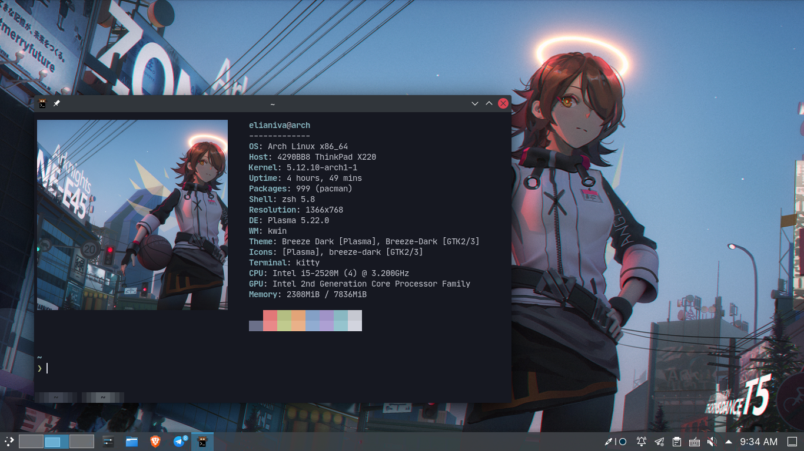
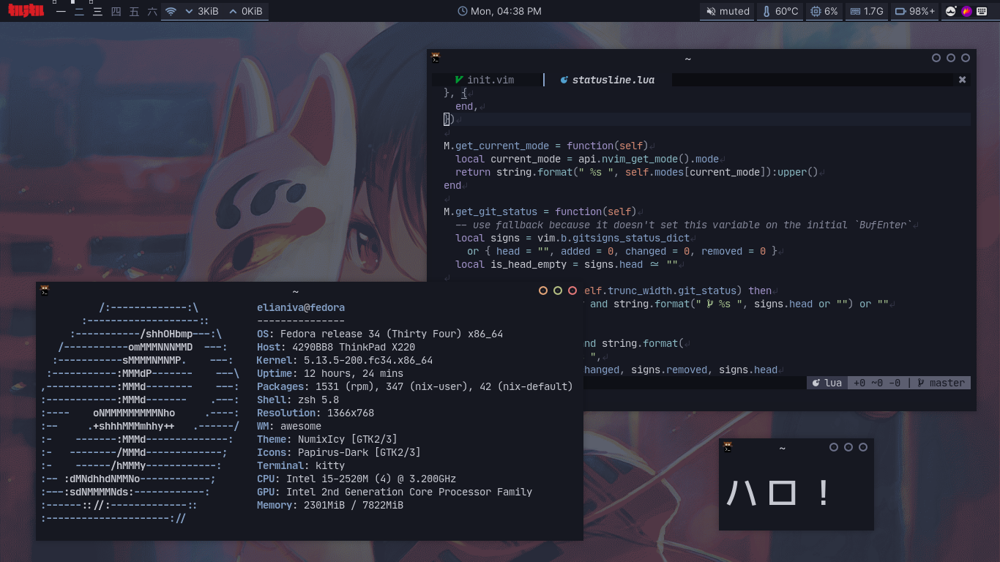

# elianiva's dotfiles

Nix-managed dotfiles for **macOS (nix-darwin + home-manager)** and **Linux (home-manager standalone)** with full feature parity. Built on [Determinate Nix](https://determinate.systems/nix/) (`nixd`).

Here are some of the screenshots from time to time (the config may or may not be still here, idk):








---

## Architecture

```
flake.nix
├── darwinConfigurations.melon        # aarch64-darwin — nix-darwin + home-manager + nix-homebrew
│   ├── modules/darwin-config.nix    # system defaults, homebrew, fonts
│   ├── modules/darwin-home.nix      # macOS-specific home symlinks (Library/Application Support)
│   └── modules/home-common.nix      # shared: shells, editors, terminals, git, gpg, etc.
└── homeConfigurations.elianiva       # x86_64-linux — home-manager standalone
    ├── modules/linux-home.nix       # nixGL, fontconfig, nix.gc
    ├── modules/linux-terminals.nix  # ghostty nixGL wrapper only
    └── modules/home-common.nix      # same shared base as macOS
```

Shared sources of truth:

| Concern | Defined once | Used by |
|---------|--------------|---------|
| CLI tools & editors | `modules/packages.nix` | both platforms |
| Rust toolchain (fenix) | `modules/rust.nix` | both platforms |
| Fonts (MonaSpace, Inter, Lora, Lilex, Departure Mono, Ioshelfka, Iosevka 34.8 TTC) | `modules/fonts.nix` | `darwin-config.nix` → `fonts.packages`, `linux-home.nix` → `home.packages` |
| Terminal configs (ghostty/kitty/wezterm) | `modules/home-common.nix` | both (Linux adds nixGL wrap in `linux-terminals.nix`, macOS adds `Library/Application Support` symlink in `darwin-home.nix`) |
| Direnv integrations, shell/tool configs | `modules/home-common.nix` | both |

Platform extras are thin:

- `modules/darwin-packages.nix` — `[ iina ]` only (everything else comes from `packages.nix`/`rust.nix`/`fonts.nix`)
- `modules/linux-packages.nix` — `[ pinentry-gnome3, nixGLIntel, lazydocker, zathura ]` only

---

## Prerequisites

- **Nix**: [Determinate Nix](https://determinate.systems/posts/determinate-nix/) is assumed throughout. It ships `nixd` (`determinate-nixd`), manages `/etc/nix/nix.conf` (including `nix.custom.conf`), enables `flakes` + `nix-command` by default, and provides FlakeHub caching. Stock `nix` works too, but commands below use Determinate's layout.
- **Git & curl**: needed to clone and fetch flakes.
- **Identity**: default user is `elianiva` (`/Users/elianiva` on macOS, `/home/elianiva` on Linux) and hostname `melon` — see [`modules/identity.nix`](./modules/identity.nix). If your username/home differs, edit that file *before* the first switch (or pass `--impure` with an override — not recommended).
- **Dotfiles location**: `~/.dotfiles` must remain at `~/.dotfiles` — configs are linked via `mkOutOfStoreSymlink` to that path. Moving it breaks all `xdg.configFile`/`home.file` symlinks until you re-switch.

---

## Bootstrap — Empty Linux Box (Determinate Nix)

Tested on Ubuntu/Debian/Fedora/Arch (x86_64-linux). For `aarch64-linux`, see notes at the end.

### 1. Install Determinate Nix

```bash
curl --proto '=https' --tlsv1.2 -sSf -L https://install.determinate.systems/nix | sh -s -- install
# restart shell so /nix/var/nix/profiles/default/etc/profile.d/nix.sh is sourced
exec $SHELL -l
nix --version  # should print: nix (Determinate Nix 3.x) 2.28.x
```

Determinate writes:

- `/etc/nix/nix.conf` (managed, includes `nix.custom.conf` and FlakeHub `extra-substituters`)
- `/etc/nix/nix.custom.conf` — your `trusted-users` etc. (installer adds `trusted-users = root <you>`)
- `/nix` store + `determinate-nixd` daemon

Verify daemon:

```bash
sudo determinate-nixd status 2>/dev/null || systemctl status determinate-nixd 2>/dev/null | head -n 20
```

No manual `experimental-features` edit needed — Determinate enables `nix-command flakes` out of the box (`lazy-trees` as well).

### 2. Install git & clone

```bash
# Debian/Ubuntu
sudo apt update && sudo apt install -y git curl

# Fedora
sudo dnf install -y git curl

# Arch
sudo pacman -S --needed git curl
```

```bash
git clone git@github.com:elianiva/dotfiles ~/.dotfiles
# or HTTPS if no SSH key yet:
# git clone https://github.com/elianiva/dotfiles ~/.dotfiles
cd ~/.dotfiles
```

### 3. First switch (no `nh` yet)

`nh` (nix helper) is in `packages.nix` so it will be available *after* the first switch. Bootstrap with `nix run`:

```bash
# From inside ~/.dotfiles
nix run home-manager -- switch --flake .#elianiva --print-build-logs
```

What this does:

- Imports `nixpkgs` with `allowUnfree = true` + `fenix` + `jj-starship` overlays
- Composes `packages.nix + rust.nix + linux-packages.nix + fonts.nix` into `home.packages`
- Enables `targets.genericLinux` + `nixGL` (`mesa` wrapper), `fonts.fontconfig`, `nix.gc`
- Symlinks everything via `mkOutOfStoreSymlink` — `~/.config/nvim`, `~/.config/ghostty`, `fish`, `nushell`, `jjui`, `yazi`, etc. all point into `~/.dotfiles`

**First-run conflict handling:** if you have existing `~/.config/fish`, `~/.bashrc`, etc., home-manager will error with `existing file ... would be clobbered`. Either back up and remove:

```bash
mv ~/.config/fish ~/.config/fish.bak 2>/dev/null; mv ~/.bashrc ~/.bashrc.bak 2>/dev/null
nix run home-manager -- switch --flake .#elianiva --print-build-logs -b bak
# -b bak tells home-manager to move conflicts to *.bak automatically
```

Re-login or source the new shell:

```bash
exec $SHELL -l
# or if using fish/nushell:
# exec fish -l
```

### 4. Daily usage after bootstrap

`nh` and `just` are now in `PATH`:

```bash
# rebuild after editing dotfiles
just linux
# equivalent to: nh home switch --flake .#elianiva --print-build-logs

# update flake inputs
nix flake update
just linux

# garbage collect
just clean   # nh clean
nix-collect-garbage -d

# Determinate upgrade (when Determinate publishes a new Nix)
sudo determinate-nixd upgrade
```

### 5. Post-bootstrap checks

```bash
home-manager generations | head
ghostty --version        # wrapped via nixGL.mesa on non-NixOS
fc-list | grep -i iosevka | head
gpg --list-keys
jj --version
cargo --version          # fenix rust
```

**GPU (nixGL)**: `linux-terminals.nix` wraps `ghostty` with `nixGLIntel` + `targets.genericLinux.nixGL.defaultWrapper = "mesa"`. On non-NixOS you need Mesa/Intel drivers from the host. If `ghostty` fails with GL errors, try `nix run nixGL -- ghostty` or install host `mesa-utils`.

**Fonts**: `fonts.fontconfig` is enabled with `defaultFonts.monospace = ["JetBrainsMono"]`. All fonts from `fonts.nix` are in `home.packages`; `fc-cache -f` runs automatically via home-manager.

### Linux notes & gotchas

- **Username/home mismatch**: edit `modules/identity.nix` (`platforms.linux.homeDir`) *before* the first switch, otherwise home-manager creates `/home/elianiva` while your actual `$HOME` is different.
- **aarch64-linux**: `flake.nix` currently pins `system = "x86_64-linux"` for `homeConfigurations.elianiva`. On ARM, either change that string to `aarch64-linux` or add a second entry. `nixGLIntel` is Intel-only — replace with `nixGLMesa` or omit.
- **Nix-managed Nix**: `linux-home.nix` sets `nix.enable = true` (home-manager manages Nix). This is intentional for standalone home-manager — on NixOS you'd disable it. On macOS, `nix.enable = false` because Determinate manages Nix.
- **Docker**: `lazydocker` + `zathura` are Linux-only extras; install Docker Engine separately (`sudo apt install docker.io` etc.) — not managed by this flake.
- **FlakeHub 401 warning** (`unable to download https://cache.flakehub.com/nix-cache-info`): harmless if you haven't run `determinate-nixd auth login`. Either `determinate-nixd login` or ignore — `cache.nixos.org` + `nix-community` are still used via `nixConfig`.

---

## Bootstrap — macOS (Determinate Nix + nix-darwin)

### 1. Install Determinate Nix

```bash
curl --proto '=https' --tlsv1.2 -sSf -L https://install.determinate.systems/nix | sh -s -- install
exec $SHELL -l
nix --version
```

### 2. Install Xcode CLI & clone

```bash
xcode-select --install
# verify
xcode-select -p

git clone git@github.com:elianiva/dotfiles ~/.dotfiles
cd ~/.dotfiles
```

### 3. First switch

`nix-darwin` needs `sudo` on first run to install the system profile and create `/etc/nix/nix.conf` integration. Determinate already manages Nix, so `darwin-config.nix` sets `nix.enable = false`.

```bash
# first time — builds darwin system + home-manager generation
sudo nix run nix-darwin -- switch --flake .

# after that, via just/nh (nh is in systemPackages after first switch)
just darwin
# equivalent to: nh darwin switch .
```

What this does:

- `darwinSystem` `aarch64-darwin` with `fenix`/`jj-starship` overlays
- `nix-homebrew` declaratively taps `homebrew/core`, `cask`, `bundle`, `BarutSRB`, `onevcat` (`mutableTaps = false`)
- `homebrew` brews/casks from `modules/brews.nix`/`casks.nix` (`onActivation.cleanup = "zap"`)
- `environment.systemPackages` = `packages.nix + rust.nix + darwin-packages.nix`
- `fonts.packages` = `fonts.nix` (includes Iosevka 34.8 TTC)
- `home-manager` user `elianiva` with `darwin-home.nix + git.nix + gpg.nix`
- Symlinks `~/Library/Application Support/nushell`, `~/Library/Application Support/com.mitchellh.ghostty` + `~/.config/*` via `mkOutOfStoreSymlink`

### 4. Daily usage

```bash
just darwin
# or: nh darwin switch .

nix flake update
just darwin

just clean
sudo determinate-nixd upgrade
```

### macOS notes

- **Hostname**: default `melon` in `modules/identity.nix`. Change it there or `sudo scutil --set HostName <new>` before switch.
- **Homebrew**: managed declaratively. Do not `brew install` manually — add to `modules/brews.nix`/`casks.nix`. `mutableTaps = false` means manual `brew tap` will be reverted.
- **Rosetta**: `nix-homebrew.enableRosetta = true` allows x86 brews on Apple Silicon.
- **Touch ID for sudo**: `security.pam.services.sudo_local.touchIdAuth = true` — works after first switch.
- **Determinate `nix.conf`**: `/etc/nix/nix.conf` is owned by Determinate (`!include nix.custom.conf`). Do not edit directly — use `nix.custom.conf` or `nixConfig` in `flake.nix`.

---

## Common Tasks

| Task | macOS | Linux |
|------|-------|-------|
| Rebuild | `just darwin` | `just linux` |
| Update inputs | `nix flake update && just darwin` | `nix flake update && just linux` |
| Check flake | `nix flake check` | same |
| Dry build | `nix build .#darwinConfigurations.melon.system --dry-run` | `nix build .#homeConfigurations.elianiva.activationPackage --dry-run` |
| GC | `just clean` | same |
| Edit identity (user/home/host) | `modules/identity.nix` | same |
| Add CLI tool | `modules/packages.nix` | same (shared) |
| Add font | `modules/fonts.nix` | same |
| Add macOS-only package | `modules/darwin-packages.nix` | — |
| Add Linux-only package | — | `modules/linux-packages.nix` |
| Add brew/cask | `modules/brews.nix` / `casks.nix` | n/a (use nixpkgs) |

---

## Troubleshooting

**`existing file … would be clobbered` on first switch** — backup or use `-b bak`:
```bash
nix run home-manager -- switch --flake .#elianiva -b bak
sudo nix run nix-darwin -- switch --flake . -b bak
```

**`attribute 'aarch64-darwin' missing` for `ioshelfka`** — `fonts.nix` already guards with `if ioshelfka.packages ? system then ... else []`. If you add a new font flake, guard similarly.

**`error: Path 'modules/fonts.nix' is not tracked by Git`** — `git add modules/fonts.nix` (Nix only sees git-tracked files for flakes).

**`command not found: nh` before first switch** — expected. Use `nix run nixpkgs#nh -- home switch --flake .#elianiva` or `nix run home-manager -- switch ...` for bootstrap.

**Linux `ghostty` GL errors** — ensure `nixGLIntel` matches your GPU. For AMD/Generic Mesa: change `targets.genericLinux.nixGL.defaultWrapper = "mesa"` is already set; for NVIDIA use `nixGLNvidia`.

**Home not at `~/.dotfiles`** — re-clone to `~/.dotfiles` or update `modules/identity.nix` `dotfiles` and `mkIdentity` logic.

---

## License

Personal dotfiles — no license, use at your own risk.
