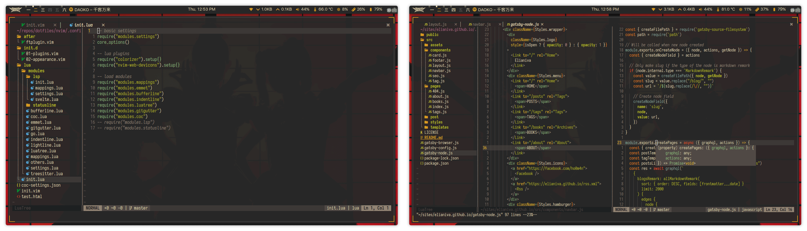

# My Neovim Config

This neovim config is mostly lua. It's using coc.nvim right now, but it's also has nvim-lsp configuration if you prefer. I use this mainly to write Javascript/Typescript/Svelte code and sometimes Java.

## Preview

## Details
**Plugins:**
- [vim-plug](https://github.com/junegunn/vim-plug)
- [gruvbox](https://github.com/gruvbox-community/gruvbox)
- [auto-pairs](https://github.com/jiangmiao/auto-pairs)
- [codi.vim](https://github.com/metakirby5/codi.vim)
- [jsonc.vim](https://github.com/neoclide/jsonc.vim)
- [vim-wakatime](https://github.com/wakatime/vim-wakatime)
- [nvim-colorizer.lua](https://github.com/norcalli/nvim-colorizer.lua)
- [vim-polyglot](https://github.com/sheerun/vim-polyglot)
- [java-syntax.vim](https://github.com/uiiaoo/java-syntax.vim)
- [BetterLua.vim](https://github.com/euclidianAce/BetterLua.vim)
- [vim-svelte](https://github.com/evanleck/vim-svelte)
- [indentline](https://github.com/Yggdroot/indentline)
- [goyo.vim](https://github.com/junegunn/goyo.vim)
- [vim-table-mode](https://github.com/dhruvasagar/vim-table-mode)
- [vim-smoothie](https://github.com/psliwka/vim-smoothie)
- [nvim-web-devicons](https://github.com/kyazdani42/nvim-web-devicons)
- [nvim-bufferline.lua](https://github.com/akinsho/nvim-bufferline.lua)
- [nvim-treelua](https://github.com/kyazdani42/nvim-tree.lua)
- [coc.nvim](https://github.com/neoclide/coc.nvim)
- [vim-snippets](https://github.com/honza/vim-snippets)
- [vim-commentary](https://github.com/tpope/vim-commentary)
- [emmet-vim](https://github.com/mattn/emmet-vim)
- [vim-surround](https://github.com/tpope/vim-surround)
- [popup.nvim](https://github.com/nvim-lua/popup.nvim)
- [plenary.nvim](https://github.com/nvim-lua/plenary.nvim)
- [telescope.nvim](https://github.com/nvim-lua/telescope.nvim)
- [vim-fugitive](https://github.com/tpope/vim-fugitive)
- [vim-gitgutter](https://github.com/airblade/vim-gitgutter)

**COC Extensions:**
- coc-eslint
- coc-tslint-plugin
- coc-json
- coc-css
- coc-html
- coc-stylelint
- coc-tsserver
- coc-prettier
- coc-svelte
